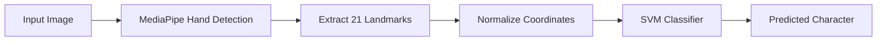

<div align="center">

# 🤟 ASL Recognition System

### 🚀 Real-time American Sign Language Translation (CPU-Optimized)


<br>

🔥 **Fast – Lightweight – Real-time – No GPU Required**

</div>

---

## 🧠 Problem

Hầu hết các hệ thống nhận diện ngôn ngữ ký hiệu sử dụng Deep Learning:

* ❌ Model nặng (CNN, LSTM)
* ❌ Cần GPU
* ❌ Latency cao

👉 Không phù hợp cho ứng dụng **real-time trên máy yếu**

---

## 💡 Solution

Dự án sử dụng hướng tiếp cận tối ưu hơn:

* 📌 **MediaPipe** → Trích xuất 21 landmarks bàn tay
* 📌 **Feature Engineering** → Chuẩn hóa dữ liệu
* 📌 **SVM** → Phân loại nhanh và nhẹ

👉 Kết quả:

* ⚡ 30+ FPS trên CPU
* ⚡ Accuracy ~99%
* ⚡ Model ~2MB

---

## ⚙️ System Pipeline



---

## ✨ Key Features

### ⚡ High Performance

* 30+ FPS trên CPU (không cần GPU)
* Latency < 10ms

### 🛡️ Noise Reduction

* Majority Voting (10 frames)
* Giảm rung và sai prediction

### ⏳ Smart Input (Dwell Time)

* Giữ tay để xác nhận ký tự
* Tránh nhập nhầm

### ⌨️ Virtual Keyboard

* `Space` → khoảng trắng
* `Delete` → xóa

---

## 📂 Project Structure

```bash
asl-recognition/
│
├── data/
│   └── processed/         # CSV landmarks
│
├── models/                # SVM model + scaler
├── results/               # Confusion Matrix 
│
├── src/
│   ├── app.py             # 🎯 Real-time app
│   ├── collect_landmarks.py  # 📊 Feature extraction
│   ├── train_model.py     # 🧠 Training
│
├── requirements.txt
└── README.md
```

---

## 📊 Nguồn Dữ liệu (Dataset)
Lưu ý: Bộ dữ liệu gốc (Raw Images) có dung lượng khoảng 1GB nên không được lưu trữ trực tiếp trên Repository này để đảm bảo hiệu suất.

Tải bộ dữ liệu ASL Alphabet Dataset từ Kaggle.
Link: https://www.kaggle.com/datasets/grassknoted/asl-alphabet

Giải nén và đặt các thư mục chữ cái (A, B, C...) vào đường dẫn: data/.

## 🚀 Getting Started

### 1. Install dependencies

```bash
pip install -r requirements.txt
```

### 2. Extract features

```bash
python src/collect_landmarks.py
```

### 3. Train model

```bash
python src/train_model.py
```

### 4. Run real-time app

```bash
python src/app.py
```

---

## 📊 Results

| Metric     | Value  |
| ---------- | ------ |
| Accuracy   | > 99%  |
| Latency    | < 10ms |
| FPS        | 30+    |
| Model Size | ~2.1MB |

---

## 📸 Demo

👉 Nên thêm:

* GIF webcam demo
* Hoặc video YouTube

---

## 🧩 Tech Stack

* Python
* MediaPipe
* Scikit-learn (SVM)
* OpenCV

---


## 🤝 Author

**Nguyen Bao**

* AI / Computer Vision 

---

## ⭐ Future Improvements

* Word prediction (NLP)
* Nhận diện câu thay vì ký tự
* Deploy Web (Streamlit / Flask)
* Mobile version

---

<div align="center">

🔥 Nếu thấy project hữu ích → hãy ⭐ repo nhé!

</div>
